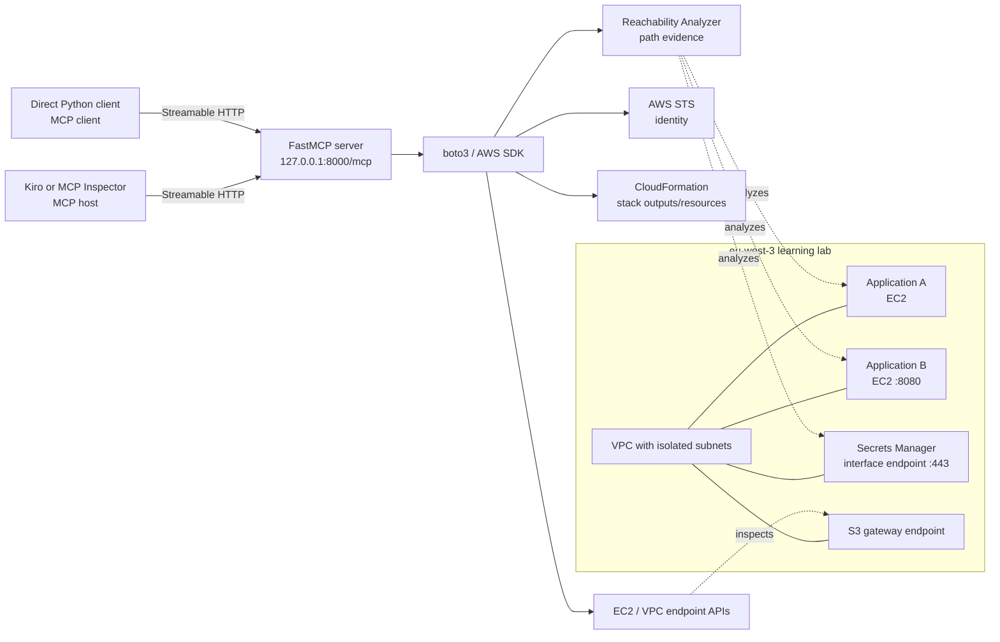

# End-to-end architecture

```mermaid
flowchart LR
    H[Kiro or MCP Inspector\nMCP host] -->|Streamable HTTP| S[FastMCP server\n127.0.0.1:8000/mcp]
    C[Direct Python client\nMCP client] -->|Streamable HTTP| S
    S --> SDK[boto3 / AWS SDK]
    SDK --> STS[AWS STS\nidentity]
    SDK --> CFN[CloudFormation\nstack outputs/resources]
    SDK --> RA[Reachability Analyzer\npath evidence]
    SDK --> VPCE[EC2 / VPC endpoint APIs]
    subgraph AWS[eu-west-3 learning lab]
      VPC[VPC with isolated subnets]
      A[Application A\nEC2]
      B[Application B\nEC2 :8080]
      SM[Secrets Manager\ninterface endpoint :443]
      S3[S3 gateway endpoint]
      VPC --- A
      VPC --- B
      VPC --- SM
      VPC --- S3
    end
    RA -. analyzes .-> A
    RA -. analyzes .-> B
    RA -. analyzes .-> SM
    VPCE -. inspects .-> S3
```

The server exposes narrow read/diagnostic tools. It does not mutate security groups, routes, endpoints, or IAM automatically.
