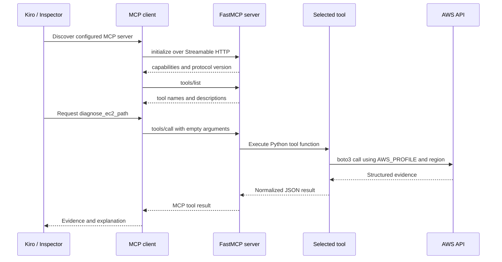

# MCP request flow

```mermaid
sequenceDiagram
    participant Host as Kiro / Inspector
    participant Client as MCP client
    participant Server as FastMCP server
    participant Tool as Selected tool
    participant AWS as AWS API
    Host->>Client: Discover configured MCP server
    Client->>Server: initialize over Streamable HTTP
    Server-->>Client: capabilities and protocol version
    Client->>Server: tools/list
    Server-->>Client: tool names and descriptions
    Host->>Client: Request diagnose_ec2_path
    Client->>Server: tools/call with empty arguments
    Server->>Tool: Execute Python tool function
    Tool->>AWS: boto3 call using AWS_PROFILE and region
    AWS-->>Tool: Structured evidence
    Tool-->>Server: Normalized JSON result
    Server-->>Client: MCP tool result
    Client-->>Host: Evidence and explanation
```

MCP standardizes discovery, invocation, and result exchange. AWS IAM still controls what the tool is allowed to call.
