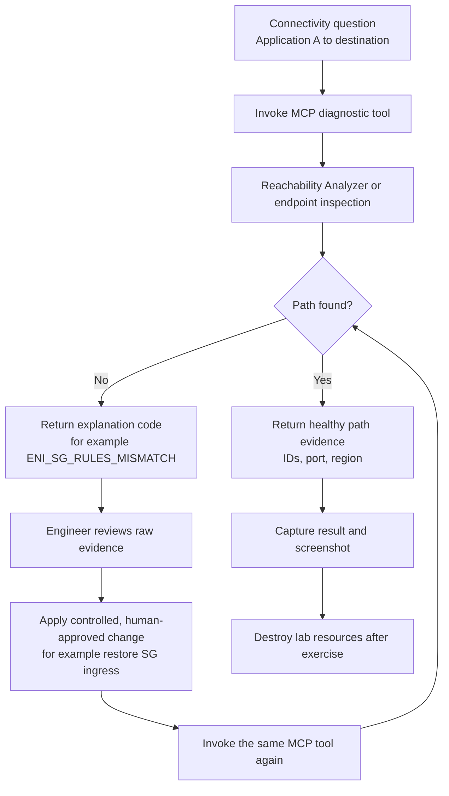

# Diagnosis and remediation flow

```mermaid
flowchart TD
    Start[Connectivity question\nApplication A to destination] --> Call[Invoke MCP diagnostic tool]
    Call --> Evidence[Reachability Analyzer or endpoint inspection]
    Evidence --> Path{Path found?}
    Path -->|Yes| Healthy[Return healthy path evidence\nIDs, port, region]
    Path -->|No| Explain[Return explanation code\nfor example ENI_SG_RULES_MISMATCH]
    Explain --> Review[Engineer reviews raw evidence]
    Review --> Fix[Apply controlled, human-approved change\nfor example restore SG ingress]
    Fix --> Recheck[Invoke the same MCP tool again]
    Recheck --> Path
    Healthy --> Record[Capture result and screenshot]
    Record --> Cleanup[Destroy lab resources after exercise]
```

The loop demonstrates diagnosis and evidence-based remediation without giving the MCP server automatic write authority.
